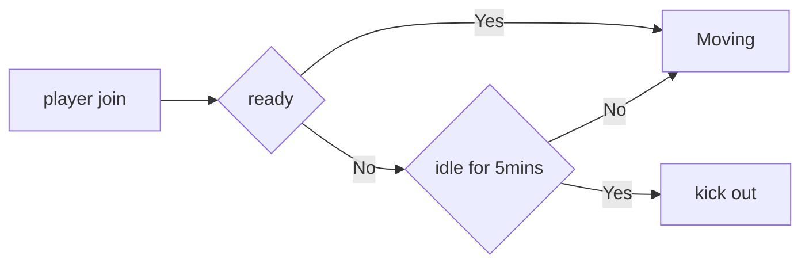
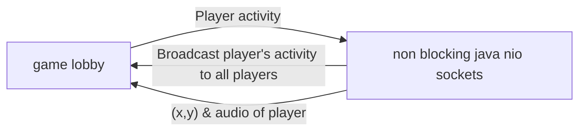
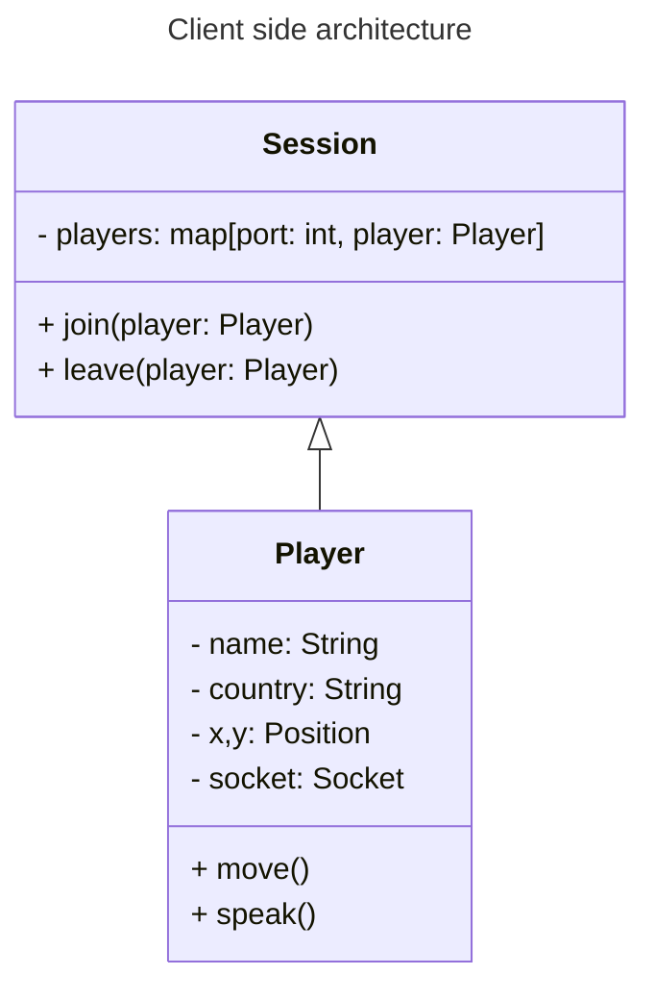

## Problem statement

I want to build a game lobby where people can come and join. 

## Player journey



Requirements
- player once joins in can speak, move
- if player remains idle for 5mins he will get kicked out

## High level architecture





Requirements
- player joins in, types name, select country with flag
- game ui or lobby having all players
- player movement, audio would be communicated with Java NIO server
- java server will communicate player new position and will deliver audio to other player's socket


## UI requirements
- make a game lobby with some trees, forest, water, houses in the environment
- make like minecraft and a decently large gaming field
- players should have name and country flag over the head of the character
- audio permission should be asked when any player enters the game

## Instructions while building

- I want to use threeJS with react in frontend
- Use Socket.IO for frontend communication with the backend
- in backend please don't go and code that I will implement myself
- Do not add comments in the code
- use OOPS in typescript
- suggest me a plan before starting to code

## Dependencies

```
npm install three@0.178.0 @types/three@0.178.1 socket.io-client@4.8.1 @react-three/fiber@8.15.19 @react-three/drei@9.92.7 uuid@9.0.1 @types/uuid@9.0.8 react@18.2.0 react-dom@18.2.0 typescript@4.9.5 @types/react@18.2.48 @types/react-dom@18.2.18 react-scripts@5.0.1 --legacy-peer-deps
```

- **three**: 3D library for creating the game environment
- **@types/three**: TypeScript type definitions for Three.js
- **socket.io-client**: Client library for real-time communication
- **@react-three/fiber**: React renderer for Three.js
- **@react-three/drei**: Useful helpers for React Three Fiber
- **uuid**: Library for generating unique identifiers
- **@types/uuid**: TypeScript type definitions for UUID
- **react** & **react-dom**: Core React libraries
- **typescript**: TypeScript language support
- **@types/react** & **@types/react-dom**: TypeScript type definitions for React
- **react-scripts**: Development scripts and configuration

### Compatibility Notes
- Version compatibility is important for React and Three.js ecosystem
- React 18.x works with react-three packages (Fiber 8.x, Drei 9.x)
- TypeScript 4.9.5 is needed for compatibility with react-scripts
- Always use --legacy-peer-deps flag to resolve dependency conflicts
- You may need additional packages like webpack and ajv for the build system